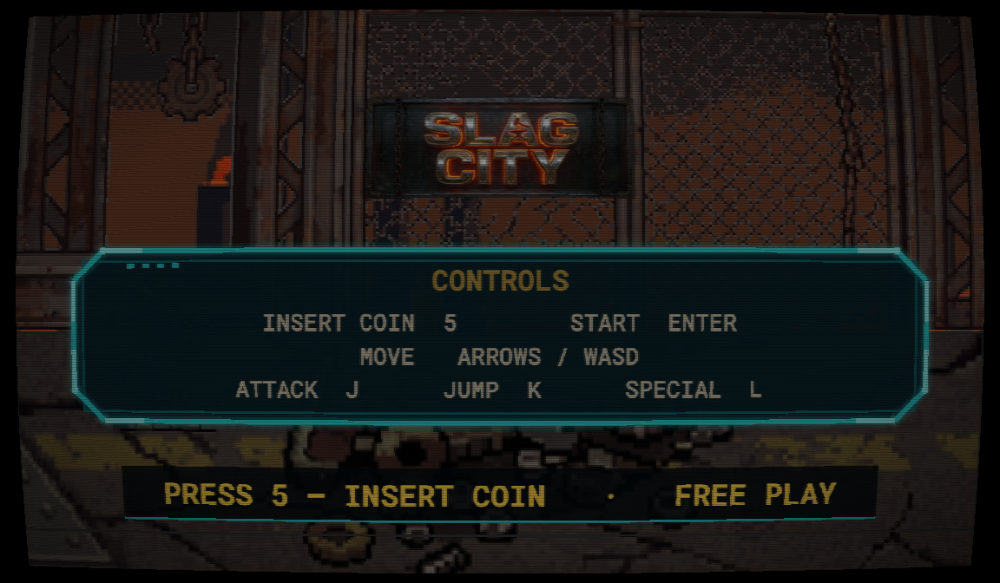
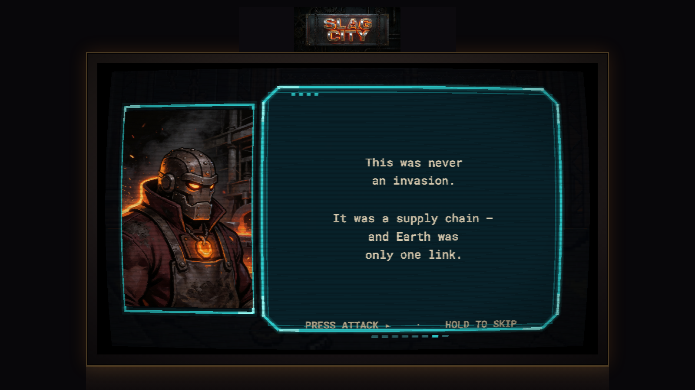
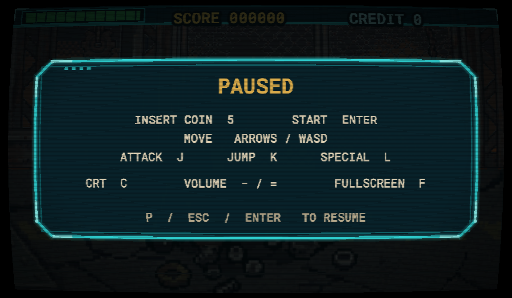
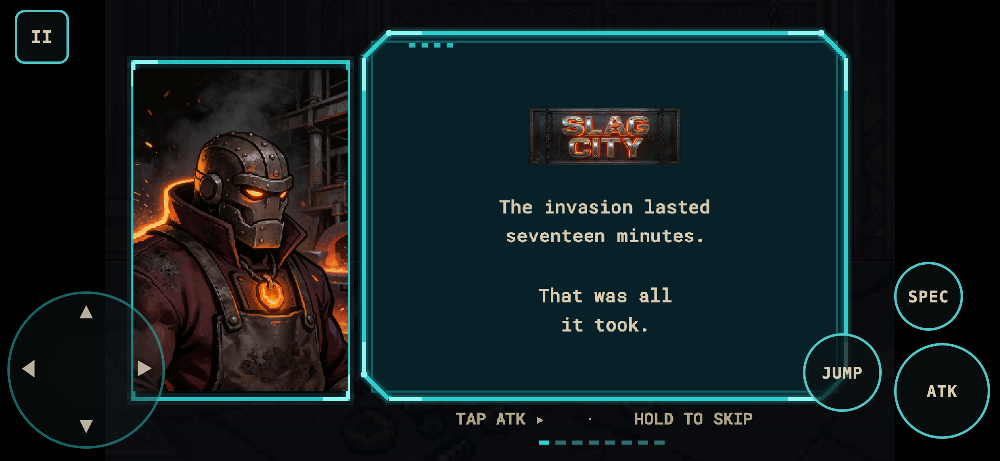

<p align="center">
  
</p>

<p align="center"><strong>An original arcade beat-'em-up that runs in your browser.</strong></p>
<p align="center">Coin-op loop · Three-boss gauntlet · Story with a twist · Keyboard, gamepad & touch · Deterministic core</p>

<p align="center">
  
  
  
  
  
  
</p>

<p align="center"><a href="https://slag-city.vercel.app"><strong>▶ Play it — slag-city.vercel.app</strong></a></p>

---

**SLAG CITY** is a side-scrolling brawler built the way a coin-op cabinet behaves: attract mode, insert coin, fight, continue countdown, initials on the hi-score table. The invasion lasted seventeen minutes; the machines — the Veydrons — turned Earth to slag, and you crawl out of the rubble with a forge hammer to find Kilvish, the warlord who gave the order. It is one complete stage, wholly original (art, story, code, synthesised audio), playable on a desktop in a simulated cabinet or on a phone with on-screen controls. Coins are free.

## Highlights

- **A full coin-op machine, not just a level** — attract loop (title → recorded demo → hi-score table), credits, a 10-second CONTINUE countdown, GAME OVER with your final score, AAA initials entry with a `1CC` marker, persisted locally in IndexedDB.
- **A three-boss gauntlet with dialogue** — Grist → Slagjaw → Kilvish, each with its own robot sprite set, a pre-fight exchange and a dying one; the game freezes while you read, and the last boss rolls into an *End of Chapter One* outro.
- **Story that pays off** — an eight-slide intro and a twist delivered in the boss dialogue. Tap to advance, hold ~0.6 s to skip; returning players open on the last slide and can skip boss dialogue too.
- **Plays on phones** — touch devices skip the cabinet and get a full-screen layout: 8-way thumb D-pad, ATK / JUMP / SPEC, COIN / START shown only where they act, a pause button, and rendering at the device's pixel density so text stays crisp.
- **Pause that doubles as help** — `P`, `Esc`, `Enter` or gamepad Start opens a panel with the control map, CRT toggle, volume and fullscreen.
- **An adaptive cabinet** — marquee, bezel and CRT pass on desktop; the marquee and panel drop away automatically when that lets the game render a whole scale step larger (typical laptops get ×3 instead of ×2).
- **Prompts that name the real button** — "PRESS 5 — INSERT COIN · FREE PLAY" on a keyboard, "TAP COIN" on a phone; one source of truth for every prompt.
- **Deterministic simulation** — the game logic is pure TypeScript with a seeded RNG; recorded input replays are hashed in tests, so a behaviour change fails a golden instead of surprising you.

## Screenshots

### Attract screen — controls and the call to action


### In the foundry — combat and HUD


### Pause — the in-game control map


### On a phone — story intro with touch controls


## Controls

| Action | Keyboard | Gamepad | Touch |
|---|---|---|---|
| Move | Arrow keys / `WASD` | Stick / d-pad | D-pad (8-way) |
| Attack · Jump · Special | `J` · `K` · `L` | West · South · East | `ATK` · `JUMP` · `SPEC` |
| Insert coin · Start | `5` · `Enter` | Select · Start | `COIN` · `START` |
| Advance story / dialogue | `J` (hold to skip) | West | `ATK` (hold to skip) |
| Pause | `P` / `Esc` / `Enter` | Start | `II` |
| CRT · Volume · Fullscreen | `C` · `-` / `=` · `F` | — | — |

## Getting started

> Prerequisite: [Node.js](https://nodejs.org) **22 or newer**.

```bash
git clone https://github.com/007U5H4R/slag-city.git
cd slag-city
npm install
```

### Run it

```bash
npm run dev
```

Served at **http://localhost:5173** (Vite's default). For the production build:

```bash
npm run build
npm run preview
```

Served at **http://localhost:4173**.

## How it works

- **Core / adapter / shell split** — `src/core` is pure, deterministic game logic (entities, combat, stage locks, the arcade state machine) with no Phaser and no DOM, enforced by lint. `src/adapters/phaser` draws it: scenes, screens, views, input sources, audio. `src/shell` is the page around the game: cabinet, viewport gate, touch controls, settings, hi-score storage, analytics.
- **Fixed internal resolution** — everything renders at **384×224**. Desktop scales by an integer factor inside the cabinet; mobile renders at about the device's pixel density and lets CSS fit the canvas to the screen.
- **Input is just a frame of booleans** — keyboard, gamepad and the touch overlay are interchangeable sources OR-ed into one `InputFrame`, which is also what replays record.
- **Sprites from a pipeline** — generated sprite sheets are normalised and packed into Phaser atlases by `tools/art`; fonts are built by `tools/fonts`. Audio is synthesised in the browser with Web Audio — there are no sound files.
- **Optional, anonymous analytics** — one Mixpanel funnel (`Page Loaded → Game Started → Stage Cleared → Name Recorded`). It is off unless `VITE_MIXPANEL_TOKEN` is set at build time — without it the SDK is never downloaded — and it honours Do-Not-Track. Setup: [`docs/analytics/mixpanel-funnel.md`](./docs/analytics/mixpanel-funnel.md).

## Development

```bash
npm run check       # typecheck + lint + unit tests + production build — the gate
npm run test        # Vitest unit tests (core + shell)
npm run test:watch  # …in watch mode
npm run e2e         # Playwright: desktop smoke + mobile touch
npm run typecheck
npm run lint
npm run art:atlas   # rebuild sprite atlases from source sheets
```

Project docs: [`Design.md`](./Design.md) (visual and interaction spec) · [`docs/build/LEDGER.md`](./docs/build/LEDGER.md) (build log: what shipped and why) · [`docs/legal/title-check.md`](./docs/legal/title-check.md) (title notes).

## Credits & license

Built with [Phaser 3](https://phaser.io), [Vite](https://vite.dev) and TypeScript; UI text is set in [Roboto Mono](https://fonts.google.com/specimen/Roboto+Mono). Story, design and code are original to this project.

No licence file is included yet — all rights reserved until one is added.
